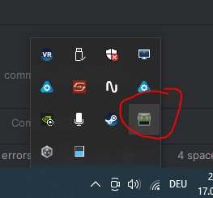
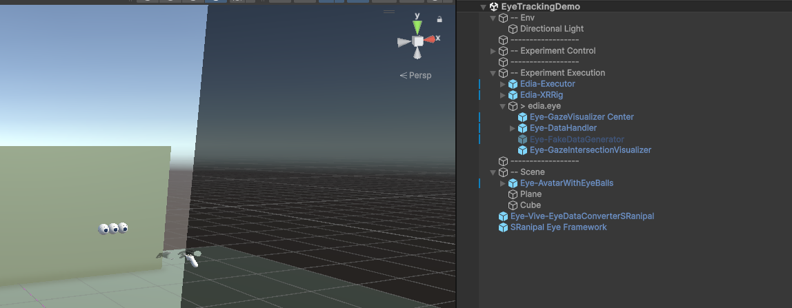

  

# EDIA Eye Vive
Support package for the HTC Vive Pro Eye Headset to provide eye tracking data in the context of the [EDIA Toolbox](edia-toolbox.github.io). 

# Features
Provides eye tracking data from a HTC Vive Pro Eye headset per eye (left, right, center) at the device's native sampling frequency (120 Hz). All samples are provided once per Unity `Update()` via the interface of the [EDIA Eye](https://github.com/edia-toolbox/edia_eye) package. The package here "only" solves the parsing into the `EDIA Eye` compatible format.   

# Installation
You need: 
1. the `SRanipal Runtime` which is the executable provided by HTC that runs the eye tracking software on your device. To get it, install the [Vive Console for SteamVR](https://store.steampowered.com/app/1635730/VIVE_Console_for_SteamVR/) from Steam. It contains the SRanipal Runtime. 
2. The `ViveSR` SDK which you need to place in your Unity project. For instructions on how to get the `ViveSR`SDK please see the [README file in the according subfolder](./Assets/com.edia.eye.vive/Runtime/SDK/README.md) of this repo.
3. The [EDIA Core](https://github.com/edia-toolbox/edia_core/) package.
4. The [EDIA Eye](https://github.com/edia-toolbox/edia_eye/) package.

# Scene setup
1. Follow the instructions on how to set up your scene as described in the [EDIA Eye](https://github.com/edia-toolbox/edia_eye) package.
2. Add the `SRanipal Eye Framework` prefab ( in `ViveSR/Prefabs`) to the scene.
3. Add the `Eye-Vive-EyeDataConverterSRanipal` from this repo ([Assets/com.edia.eye.vive/Runtime/Prefabs](./Assets/com.edia.eye.vive/Runtime/Prefabs)) to the scene.

Now you should be ready to go. When running the scene, make sure that the icon of the SRanipal Runtime in your taskbar has "green eyes".   
  

To try it out, we recommend to import the `EDIA Eye demo scene` from the `Samples` in the `EDIA Eye` package, deactivate the `Eye-FakeDataGenerator` prefab in that scene, and follow the above setup instructions. Your scene should look like this: 

If everything went well, you should now see the your gaze and the eye models follow what you are doing with your eyes. 

# Questions or problems?
Please reach out to us. You find contact info on the central repo of the [EDIA Toolbox](https://github.com/edia-toolbox/edia_core/).

# Citation
If you are using this repository for your research or other public work, please cite the [EDIA Toolbox](https://github.com/edia-toolbox/edia_core/).